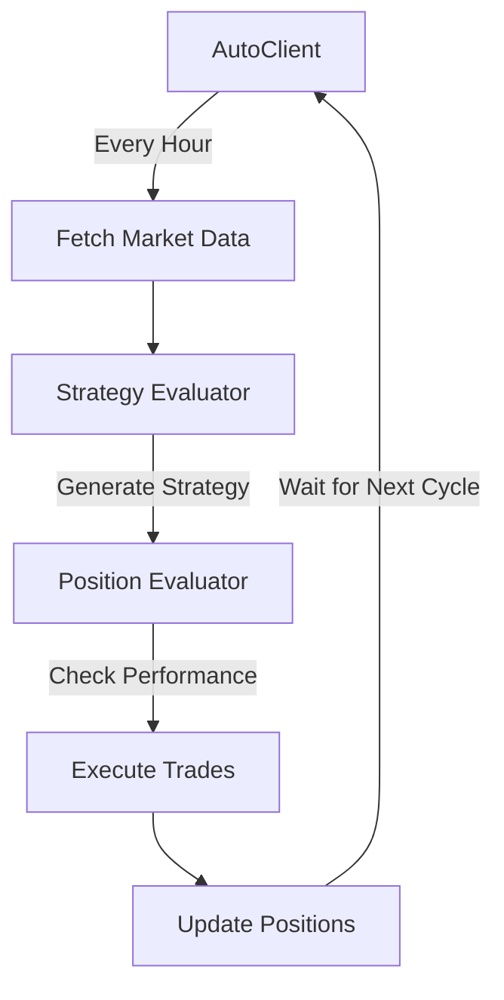

# StarkNet DeFi Automated Trading System

An autonomous trading system built on Eliza framework that manages DeFi investments across StarkNet protocols based on risk profiles and market conditions.

## Technical Architecture

### 1. Character System
Characters define investment strategies and risk profiles:
- `starknet-conservative.character.json`: Low-risk strategy (5-15% APY)
- `starknet-moderate.character.json`: Balanced strategy (20-40% APY)
- `starknet-aggressive.character.json`: High-risk strategy (100%+ APY)

Each character contains:
```json
{
  "knowledge": [
    "Portfolio Allocation: 30% lending (Nostra/zkLend), 30% DEX LP...",
    "Risk Management: minimum $2M TVL, maximum 3% slippage...",
    "Performance Metrics: Target APY ranges, risk tolerances..."
  ]
}
```

### 2. Provider System
Fetches real-time data from StarkNet:

```typescript
interface MarketData {
  tokens: {
    price: number;
    priceChange24h: number;
    volume24h: number;
  };
  protocols: {
    tvl: number;
    apy: {
      conservative: number;
      moderate: number;
      aggressive: number;
    };
    strategies: {
      minAmount: number;
      expectedApy: number;
      risk: 'conservative' | 'moderate' | 'aggressive';
    }
  };
}
```

### 3. Evaluator System
Two main evaluators:

#### Strategy Evaluator
- Parses investment amount from messages
- Analyzes market conditions
- Uses character knowledge to determine allocations
- Returns structured allocation strategy:
```typescript
interface AllocationStrategy {
  totalAmount: number;
  allocations: Array<{
    protocol: string;
    amount: number;
    strategy: string;
    expectedApy: number;
  }>;
  marketConditions: string;
  reasoning: string;
}
```

#### Position Evaluator
- Tracks current positions
- Monitors performance
- Triggers rebalancing when needed

### 4. Action System
Executes trades based on evaluator recommendations:


## Setup and Configuration

1. Install Dependencies:
```bash
pnpm i
```

2. Configure Environment:
```bash
cp .env.example .env
# Add your API keys and configuration
```

3. Start Trading System:
```bash
pnpm start --characters="characters/starknet-*.character.json"
```

## Technical Implementation Details

### Market Analysis
```typescript
function analyzeMarketConditions(marketData: MarketData) {
  const ethTrend = marketData?.tokens?.ETH?.priceChange24h || 0;
  const tvlTrend = marketData?.protocols?.totalTvlChange24h || 0;
  
  return {
    trend: ethTrend > 5 && tvlTrend > 0 ? 'bullish' : 'bearish',
    reasoning: '...'
  };
}
```

### Dynamic Allocation
```typescript
function getProtocolAllocations(
  amount: number,
  riskLevel: string,
  marketConditions: { trend: string },
  protocolData: ProtocolData,
  characterKnowledge: string[]
) {
  // Parse character's investment rules
  const preferences = parseCharacterKnowledge(characterKnowledge);
  
  // Filter and sort protocols
  const protocols = filterProtocolsByPreferences(protocolData, preferences);
  
  // Allocate funds based on character's strategy
  return calculateAllocations(amount, protocols, marketConditions);
}
```

## Safety Features

1. Risk Management:
   - TVL requirements per risk level
   - Maximum allocation per protocol
   - Slippage protection
   - Protocol audit requirements

2. Position Monitoring:
   - Real-time performance tracking
   - Automatic rebalancing triggers
   - Loss prevention mechanisms

3. Market Conditions:
   - Volatility monitoring
   - TVL change tracking
   - Price trend analysis

## Supported Protocols

- AVNU: DEX aggregator
- Ekubo: Concentrated liquidity
- Nostra: Lending markets
- zkLend: Leveraged lending
- JediSwap: AMM
- Vesu: Derivatives

## Development

### Adding New Protocols
1. Update provider to fetch protocol data
2. Add protocol strategies to character knowledge
3. Implement protocol-specific execution in actions

### Modifying Risk Profiles
1. Edit character knowledge sections
2. Update allocation percentages
3. Adjust risk parameters

### Testing
```bash
pnpm test
# Runs through full investment cycle with mock data
```

## TODO


* FIX PROVIDERS API ERROR FOR RATE LIMITING
* ADD PROTOCOL DATA TO PROVIDERS
* UPDATE EVALUATORS TO BE UTILIZE CHARACTER KNOWLEDGE
* UPDATE ACTIONS TO EXECUTE STRATEGY